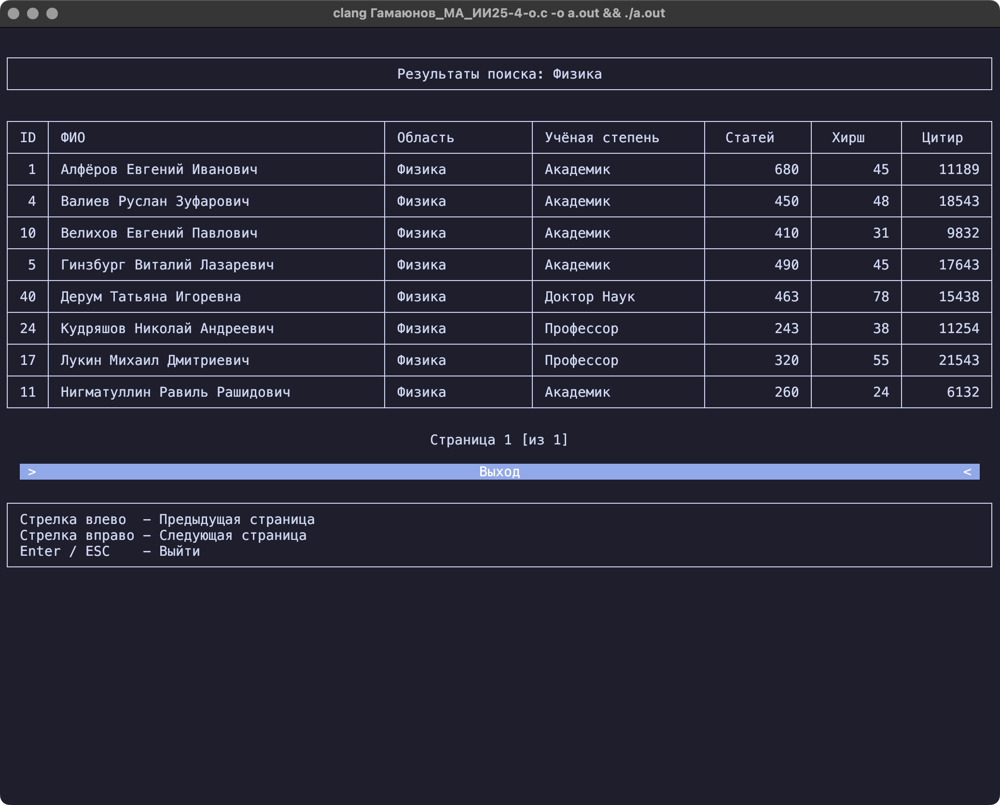
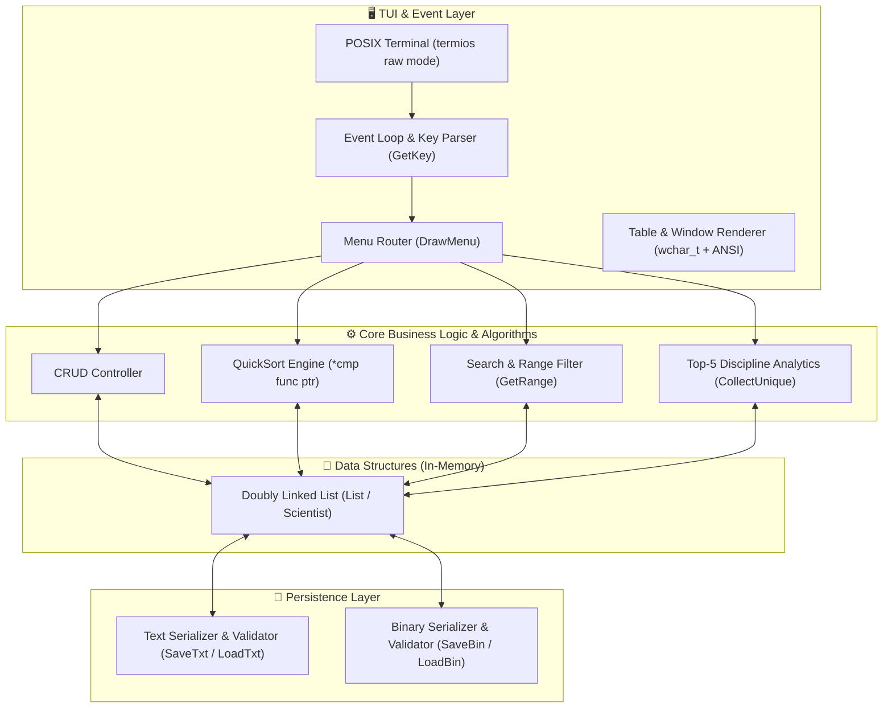

# 🏛️ Academic Researchers DBMS & Analytical Engine

[](https://en.wikipedia.org/wiki/C99)
[-000000?style=for-the-badge&logo=apple&logoColor=white)](https://en.wikipedia.org/wiki/POSIX)
[](https://en.wikipedia.org/wiki/Text-based_user_interface)
[-success?style=for-the-badge)](https://en.wikipedia.org/wiki/C_standard_library)
[](#-академический-контекст)

> **Высокопроизводительная консольная СУБД и аналитический движок на чистом Си (C99) без внешних зависимостей.**  
> Разработана в рамках курсового проекта 2-го семестра по дисциплине *«Алгоритмы и программирование»* (СевГУ).  
> Реализует собственную оконную TUI-подсистему на базе POSIX-терминала, управление динамическими структурами данных (двусвязный список), полиморфную быструю сортировку (QuickSort), аналитическую агрегацию данных и дуальную персистентность (текст/бинарный формат).

---

## 📸 Интерфейс и демонстрация работы

| Главное меню (Интерактивный TUI) | Табличный просмотр с пагинацией |
| :---: | :---: |
|  |  |
| *Полноэкранная псевдографика, навигация стрелками* | *Динамическая постраничная навигация и автовыравнивание* |

| Многокритериальная фильтрация | Аналитика: ТОП-5 по научным областям |
| :---: | :---: |
|  |  |
| *Поиск по префиксам, подстрокам и числовым диапазонам* | *Агрегация по дисциплинам, ранжирование по Хиршу и цитированиям* |

---

## ⚡ Ключевые инженерные решения

- **Нулевой оверхед по зависимостям (Zero-Dependency Architecture):**  
  Код написан исключительно на стандартах C99 / POSIX (`termios`, `fcntl`, `wchar`, `wctype`, `locale`). Не используются тяжеловесные сторонние библиотеки вроде `ncurses` — весь TUI-рендерер, ввод и обработка событий написаны с нуля.
- **Собственный TUI-движок реального времени:**  
  Перевод терминала в неканонический (non-canonical) режим без строчной буферизации (`ICANON`) и отключение локального эха (`ECHO`) через `tcgetattr` / `tcsetattr`. Парсер ANSI escape-последовательностей для обработки стрелок (`↑`, `↓`, `←`, `→`), `Enter` и `ESC`.
- **Нативная поддержка Unicode / UTF-8 (Cyrillic-First):**  
  Работа со строками через расширенные символы `wchar_t` и `wprintf`. Регистронезависимое сравнение (`CmpStr`), валидация кириллического алфавита и выравнивание псевдографических рамок с учётом фактической ширины глифов.
- **Эффективная структура данных in-memory:**  
  Динамический двусвязный список (`Doubly Linked List`) с двунаправленной навигацией и поддержкой вставки/удаления за $O(1)$ при известном узле.
- **Обобщённый QuickSort для связного списка:**  
  Реализация алгоритма быстрой сортировки Хоара, адаптированная под двусвязный список, с передачей функционального указателя (`int (*cmp)(const Scientist*, const Scientist*)`). Поддерживает сортировку по возрастанию и убыванию по любому атрибуту сущности.
- **Аналитический движок группировки (Group-by Aggregation):**  
  Сбор уникального множества научных областей в runtime (`CollectUnique`), группировка учёных по дисциплинам и формирование отчёта **Top-5** по двум метрикам: индексу Хирша ($h$-index) и объёму цитирований.
- **Дуальная система сохранения (Persistence Layer):**  
  - **Человекочитаемый текстовый формат:** структурированные поля фиксированной разметки.
  - **Бинарный дамп (`fwrite` / `fread` структуры):** высокая скорость сериализации.
  - **Защита от сбоев и валидация:** предварительная проверка целостности структуры файлов (`CheckTxtFile`, `CheckBinFile`) перед чтением.

---

## 🏗️ Архитектура системы



### Модели данных

Сущность исследователя (`Scientist`) и узел двусвязного списка (`List`):

```c
typedef struct {
    int id;                 // Уникальный автоинкрементный идентификатор
    wchar_t fam[32];        // Фамилия
    wchar_t im[32];         // Имя
    wchar_t ot[32];         // Отчество
    wchar_t obl[32];        // Научная область (дисциплина)
    wchar_t step[32];       // Учёная степень (к.т.н., д.ф.-м.н., и т.д.)
    int stat;               // Количество опубликованных статей
    int hirsh;              // Индекс Хирша (h-index)
    int cit;                // Суммарное количество цитирований
} Scientist;

typedef struct List {
    Scientist data;         // Полезная нагрузка
    struct List *prev;      // Указатель на предыдущий узел
    struct List *next;      // Указатель на следующий узел
} List;
```

---

## 📊 Алгоритмическая спецификация

| Операция | Алгоритм / Реализация | Сложность (Time) | Память (Space) | Особенности |
| :--- | :--- | :---: | :---: | :--- |
| **Сортировка базы** | QuickSort на двусвязном списке | $O(N \log N)$ ср. / $O(N^2)$ худш. | $O(\log N)$ стек | Сортировка in-place через обмен payload (`SwapSci`) с предикатами |
| **Поиск по диапазону** | Linear Scan c компаратором границ | $O(N)$ | $O(K)$ результат | Числовые интервалы $[A; B]$ для статей, Хирша и цитирований |
| **Текстовый поиск** | Substring Match / Case-folding | $O(N \cdot M)$ | $O(K)$ результат | Нечувствителен к регистру для русской и английской латиницы (`ToLow`) |
| **Аналитика ТОП-5** | Runtime Set Aggregation + Partial Sort | $O(U \cdot N)$ | $O(U)$ буфер | $U$ — число уникальных областей; выборка лидеров внутри кластера |
| **Пагинация таблицы** | Двусвязный обход блоков по 10 записей | $O(P \cdot B)$ | $O(1)$ | Моментальное переключение страниц стрелками `←` / `→` |
| **Очистка памяти** | Рекурсивный/итеративный free | $O(N)$ | $O(1)$ | Полное предотвращение утечек (`Valgrind` / `ASan` clean) |

---

## 🛠️ Сборка и запуск

### Требования к окружению
- **ОС:** macOS, Linux (любой POSIX-совместимый дистрибутив).
- **Компилятор:** `clang` (Apple Clang / LLVM) или `gcc` с поддержкой стандарта C99.
- **Терминал:** С поддержкой UTF-8 и ANSI escape-кодов (Terminal.app, iTerm2, Alacritty, Kitty, GNOME Terminal).

### Компиляция

```bash
# Клонирование репозитория
git clone https://github.com/git-sudo-ai/<repo-name>.git
cd <repo-name>

# Сборка с оптимизацией и строгими флагами проверок
clang -std=c99 -Wall -Wextra -O2 "Гамаюнов_МА_ИИ25-4-о.c" -o scientists_db

# Или с помощью GCC:
# gcc -std=c99 -Wall -Wextra -O2 "Гамаюнов_МА_ИИ25-4-о.c" -o scientists_db
```

### Запуск

```bash
./scientists_db
```

> **Совет:** Рекомендуемый минимальный размер окна терминала — **125 столбцов на 35 строк** для корректного отображения широких псевдографических рамок.

---

## 🎮 Управление в TUI

| Клавиша | Контекст | Действие |
| :---: | :---: | :--- |
| `↑` / `↓` | Главное меню / Диалоги | Перемещение курсора выбора |
| `Enter` | Везде | Подтверждение выбора / вход в подменю |
| `←` / `→` | Таблица / ТОП-5 | Перелистывание страниц пагинации |
| `ESC` | Любое подменю | Возврат на предыдущий экран / выход |

---

## 🎓 Академический контекст

- **Учебное заведение:** Севастопольский государственный университет (СевГУ / СевНТУ)
- **Институт:** Институт информационных технологий и управления в технических системах
- **Кафедра:** «Информационные технологии и системы» (ИТиС)
- **Направление подготовки:** 09.03.02 «Информационные системы и технологии»
- **Дисциплина:** Алгоритмы и программирование (2 семестр)
- **Тема работы:** Разработка программного обеспечения для обработки табличной информации со сведениями об учёных
- **Автор:** Гамаюнов М. А. ([@git-sudo-ai](https://github.com/git-sudo-ai))
- **Среда разработки:** Neovim v0.11.5, Clang, macOS (Darwin aarch64)
