# 🏛️ Academic Researchers DBMS & Analytical Engine

[](https://en.wikipedia.org/wiki/C99)
[](https://en.wikipedia.org/wiki/POSIX)
[](https://en.wikipedia.org/wiki/Text-based_user_interface)
[](https://en.wikipedia.org/wiki/C_standard_library)
[](#-академический-контекст)

> **Высокопроизводительная консольная СУБД и аналитический движок на чистом Си (C99) без внешних зависимостей.**  
> Разработана в рамках курсового проекта 2-го семестра по дисциплине *«Алгоритмы и программирование»* (СевГУ).  
> Реализует собственную оконную TUI-подсистему на базе POSIX-терминала, управление динамическими структурами данных (двусвязный список), полиморфную быструю сортировку (QuickSort), аналитическую агрегацию данных и дуальную персистентность (текст/бинарный формат).

---

## ⚡ Ключевые инженерные решения

- **Нулевой оверхед по зависимостям (Zero-Dependency Architecture):**  
  Код написан исключительно на стандартах C99 / POSIX (`termios`, `fcntl`, `wchar`, `wctype`, `locale`). Не используются сторонние библиотеки вроде `ncurses` — весь TUI-рендерер, ввод и обработка событий написаны с нуля.
- **Собственный TUI-движок реального времени:**  
  Перевод терминала в неканонический (non-canonical) режим без строчной буферизации (`ICANON`) и отключение локального эха (`ECHO`) через `tcgetattr` / `tcsetattr`. Собственный парсер ANSI escape-последовательностей для обработки стрелок (`↑`, `↓`, `←`, `→`), `Enter` и `ESC`.
- **Нативная поддержка Unicode / UTF-8 (Cyrillic-First):**  
  Работа со строками через расширенные символы `wchar_t` и `wprintf`. Регистронезависимое сравнение (`CmpStr`), валидация кириллического алфавита и выравнивание псевдографических рамок с учётом фактической ширины глифов.
- **Эффективная структура данных in-memory:**  
  Динамический двусвязный список (`Doubly Linked List`) с двунаправленной навигацией и поддержкой вставки/удаления за $O(1)$ при известном узле.
- **Обобщённый QuickSort для связного списка:**  
  Реализация алгоритма быстрой сортировки Хоара, адаптированная под двусвязный список, с передачей функционального указателя (`int (*cmp)(const Scientist*, const Scientist*)`). Поддерживает сортировку по возрастанию и убыванию по любому атрибуту сущности.
- **Интерактивный TUI-селектор уникальных значений (`PickValue`):**  
  Динамический сбор множества уникальных значений (`CollectUnique`) в runtime с отрисовкой интерактивного меню выбора с синей подсветкой.
- **Аналитический движок группировки (Group-by Aggregation):**  
  Группировка ученых по дисциплинам и формирование отчёта **Top-5** по двум метрикам: индексу Хирша ($h$-index) и объёму цитирований с постраничной сменой предметных областей.
- **Дуальная система сохранения (Persistence Layer):**  
  - Человекочитаемый текстовый формат с фиксированной разметкой полей.
  - Бинарный дамп (`fwrite` / `fread` структуры) для максимальной скорости ввода-вывода.
  - Защита от сбоев и валидация целостности файлов (`CheckTxtFile`, `CheckBinFile`) перед чтением.

---

## 📸 Пошаговая демонстрация работы и ключевых фич

Все ключевые этапы решения задач курсового проекта представлены ниже:

### 1. Главное меню и псевдографический интерфейс (Interactive TUI)
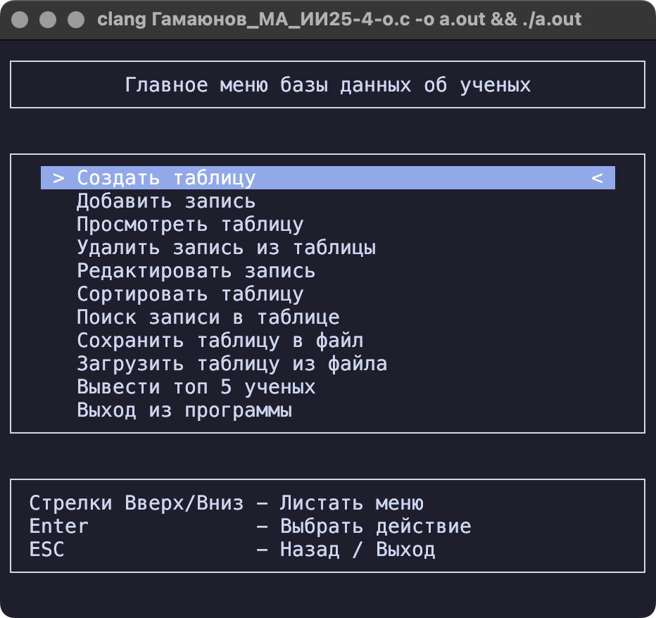
> **Инженерное решение:** Навигация стрелками (`↑`/`↓`), мгновенный отклик без нажатия `Enter` при переходе между пунктами. Оконная псевдографика (`┌─┐`, `│`, `└─┘`) с динамическим расчётом ширины окна, чистый рендеринг через ANSI-эскейп последовательности без мерцания экрана.

---

### 2. Табличный просмотр с динамической пагинацией (Pagination Engine)
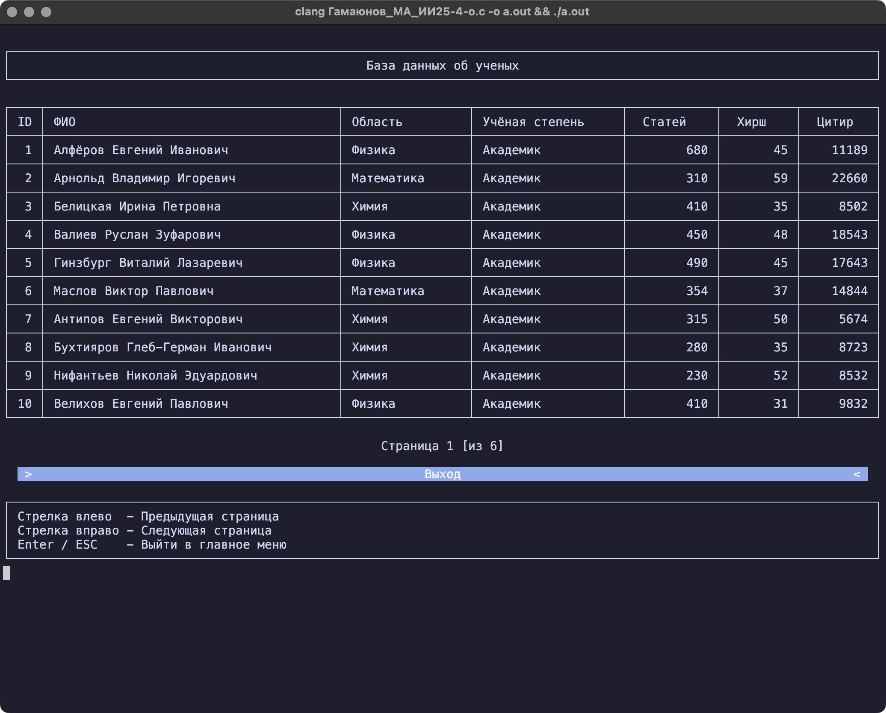
> **Инженерное решение:** Автоматическое разбиение двусвязного списка на страницы фиксированного размера (по 10 записей). Навигация между страницами клавишами `←`/`→`, расчёт общего количества страниц (`TotalPages`), моноширинное выравнивание столбцов с учётом кириллических глифов (`wchar_t`).

---

### 3. Инициализация и выбор источника данных (Data Source & Memory Guard)
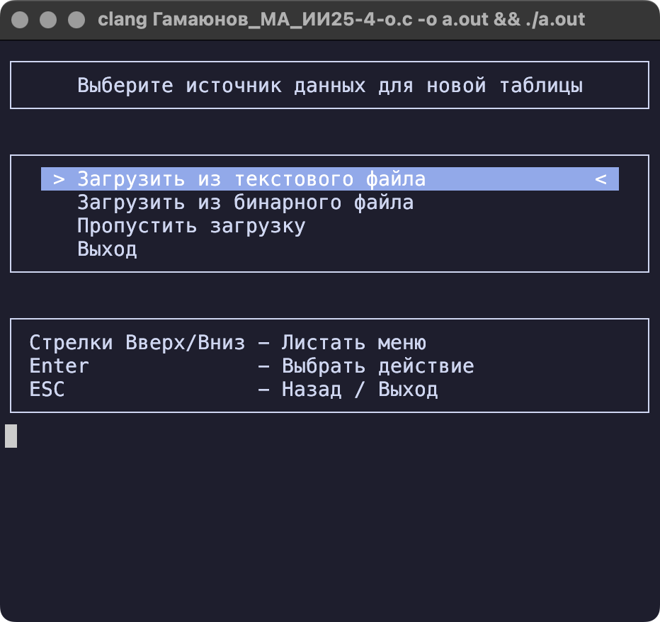
> **Инженерное решение:** Поддержка нескольких стратегий наполнения базы: ручной ввод с клавиатуры, импорт из текстового файла, чтение типизированного бинарного файла. Встроена защита от случайной потери данных: если таблица уже загружена в память, система предлагает перезаписать, дополнить существующий список или отменить действие.

---

### 4. Добавление новой записи и поэлементная валидация (Input Validation)
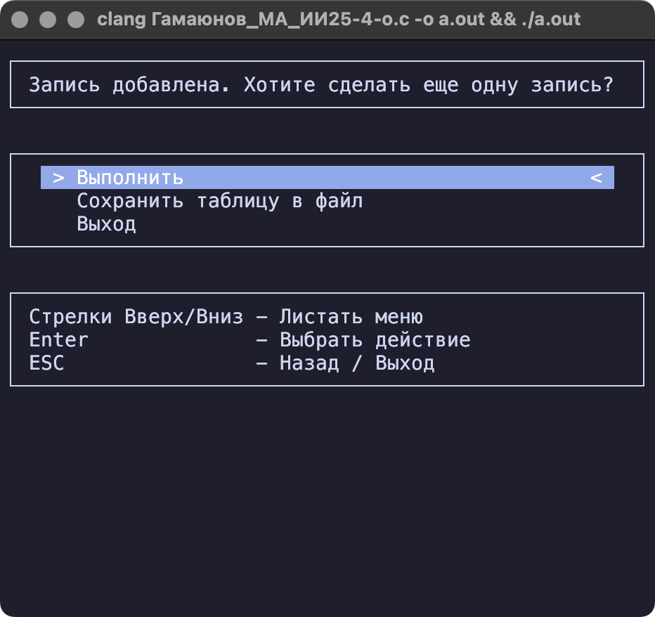
> **Инженерное решение:** Пошаговая форма ввода атрибутов с автоматической генерацией уникального первичного ключа (`NextId`). Валидация алфавитных символов (`ValidText`), автоматическая обрезка пробелов и проверка числовых ограничений на статьи, индекс Хирша и цитирования.

---

### 5. Точечное редактирование записи по ID (In-Place Update)
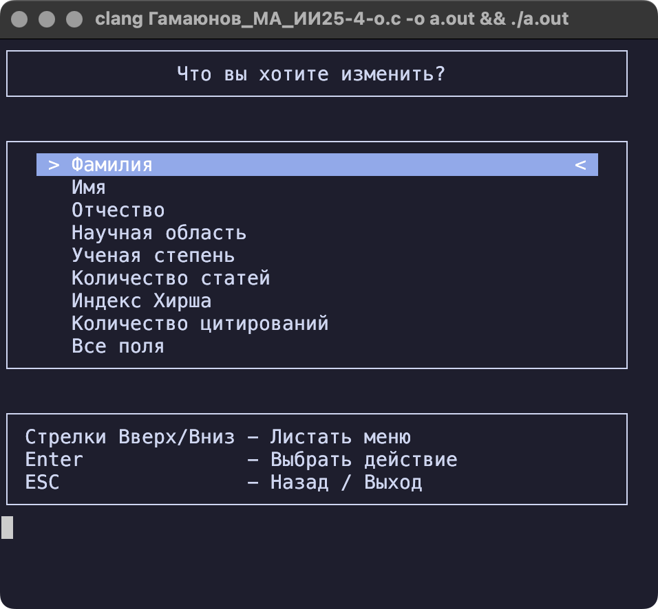
> **Инженерное решение:** Быстрый поиск целевого узла в двусвязном списке по первичному ключу за $O(N)$ и вызов специализированного контекстного меню. Позволяет изменить конкретное поле (ФИО, область, учёная степень, числовые метрики) без необходимости повторного ввода всей записи.

---

### 6. Безопасное удаление записи из связного списка (Node Deletion & Free)
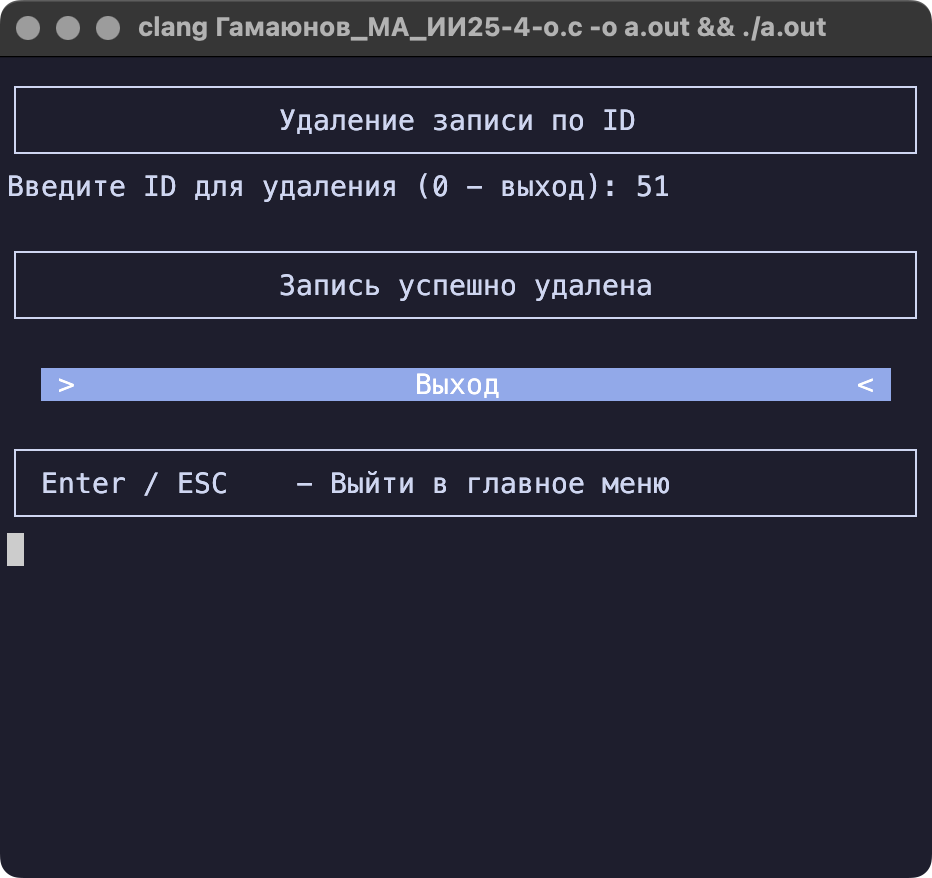
> **Инженерное решение:** Удаление записи по идентификатору. Корректная перелинковка указателей соседних узлов (`prev` и `next`), корректная обработка граничных случаев (удаление головы `head`, хвоста `tail` или единственного элемента) и гарантированное освобождение памяти через `free()`.

---

### 7. Быстрая сортировка: выбор атрибута (QuickSort Field Selector)
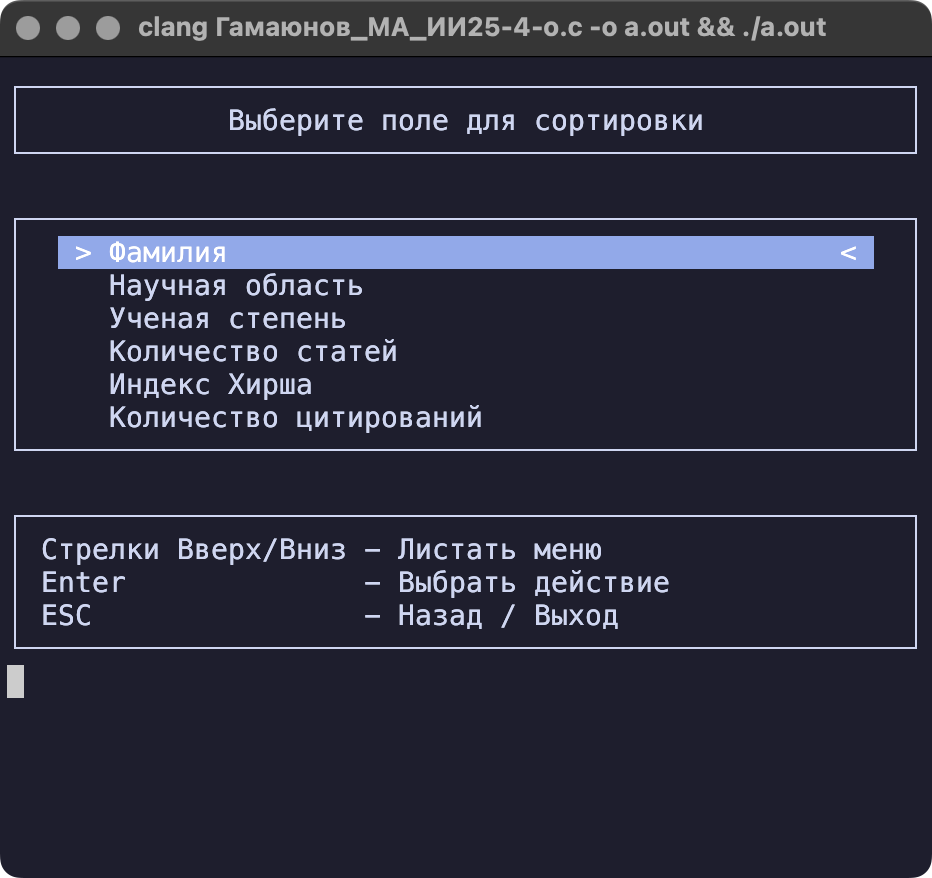
> **Инженерное решение:** Универсальный селектор атрибутов сортировки. Поддерживает упорядочивание как по строковым полям (лексикографически с учетом кириллического алфавита), так и по числовым метрикам (число статей, индекс Хирша, цитирования).

---

### 8. Быстрая сортировка: выбор направления и алгоритм Хоара (ASC / DESC)
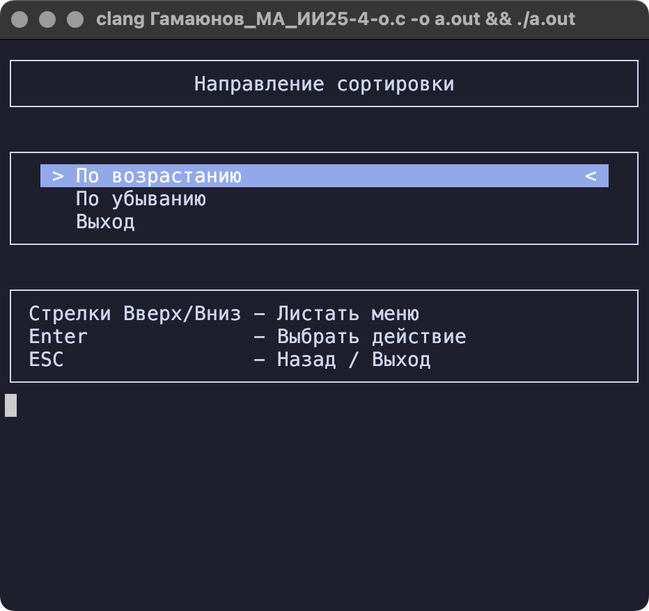
> **Инженерное решение:** Адаптация классического алгоритма QuickSort Хоара для двусвязного списка без выделения дополнительной динамической памяти под промежуточные массивы. Использование функциональных указателей-компараторов (`cmp`) и обмен содержимым узлов (`SwapSci`) со средней сложностью $O(N \log N)$.

---

### 9. Многокритериальный поиск: маршрутизация запроса (Search Query Router)
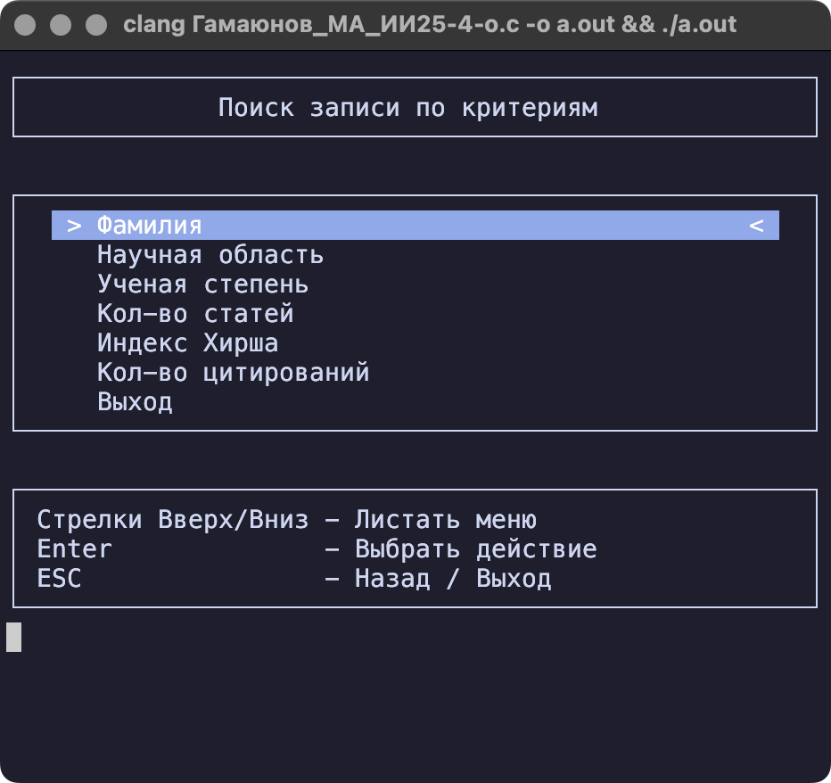
> **Инженерное решение:** Гибкий поисковый движок, позволяющий выполнять фильтрацию как по текстовым атрибутам (фамилия, область, учёная степень), так и по числовым показателям эффективности учёного.

---

### 10. Интерактивный TUI-селектор уникальных значений (`PickValue`)
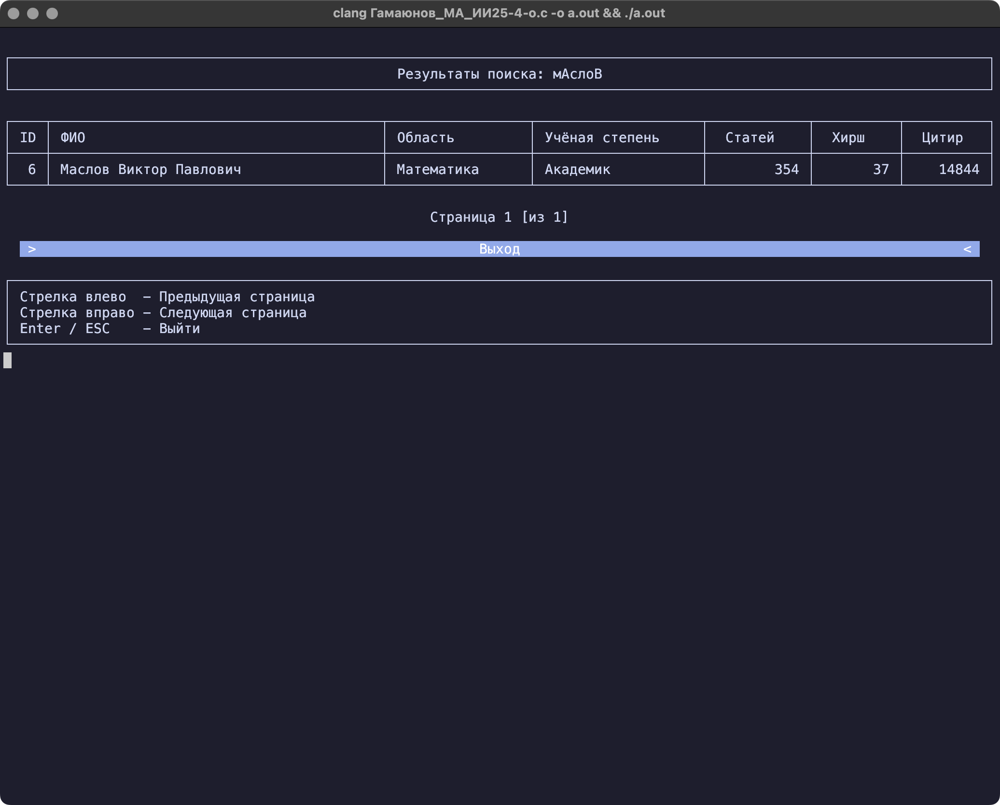
> **Инженерное решение:** Киллер-фича проекта: функция `CollectUnique` сканирует загруженную базу, формирует массив уникальных названий научных областей/степеней и отрисовывает интерактивное диалоговое окно со стрелочной навигацией и контрастной синей подсветкой курсора. Пользователю не нужно набирать длинные строки вручную.

---

### 11. Числовая диапазонная фильтрация (`GetRange`)
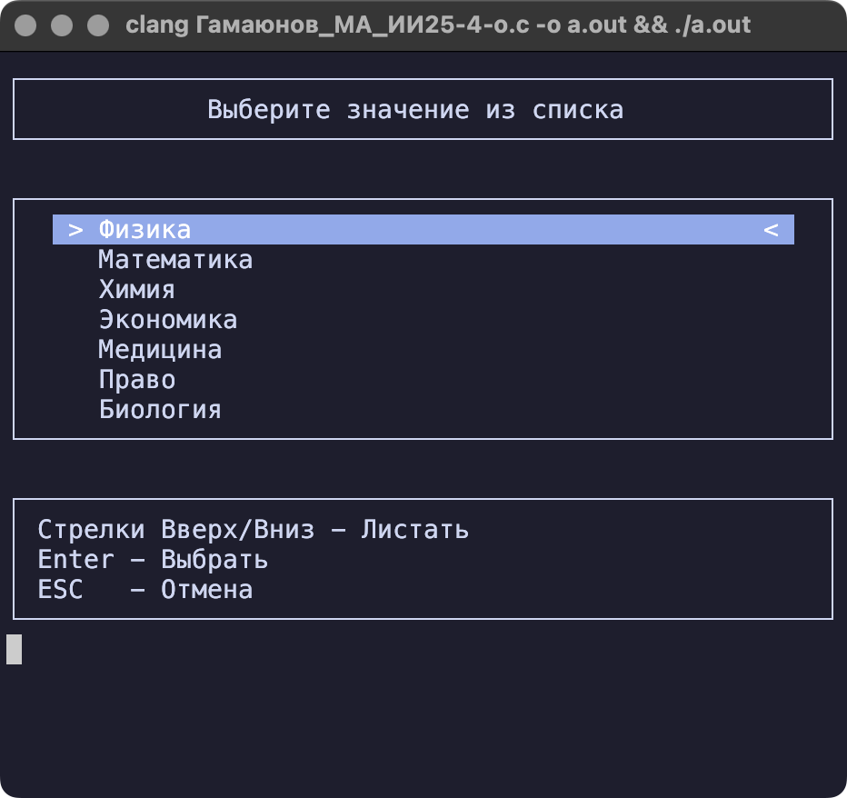
> **Инженерное решение:** Поиск исследователей по числовым интервалам (например, индекс Хирша от 10 до 25 или количество цитирований от 500 до 2000). Ввод верифицируется на корректность границ ($A \le B$) и неотрицательность числовых значений.

---

### 12. Изолированный вывод результатов выборки (Filtered View)

> **Инженерное решение:** Результаты поиска динамически компонуются и выводятся в отдельном табличном представлении с сохранением форматирования колонок и автовыравнивания, не разрушая целостность основной таблицы в памяти.

---

### 13. Групповая аналитика: ТОП-5 ученых по научным областям (Analytical Aggregation)
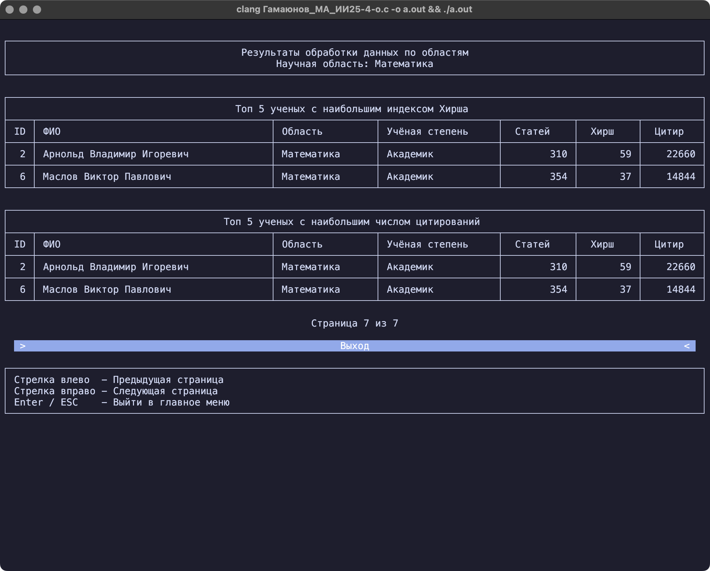
> **Инженерное решение:** Реализация алгоритма аналитической группировки (`Group-by`): разбиение всей базы на кластеры по научным областям, локальная сортировка кандидатов внутри каждой группы и построение параллельного рейтинга **ТОП-5 по индексу Хирша** и **ТОП-5 по числу цитирований**. Переключение между научными областями происходит постранично по нажатию стрелок `←` / `→`.

---

### 14. Экспорт данных и дуальная персистентность (Persistence Layer)
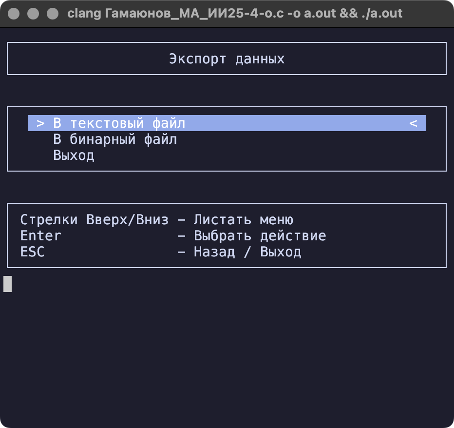
> **Инженерное решение:** Поддержка экспорта в двух форматах: структурированный человекочитаемый текст и типизированный бинарный файл (`fwrite`). Перед импортом из любого источника встроенный валидатор (`CheckTxtFile` / `CheckBinFile`) проверяет заголовок и структуру на отсутствие повреждений.

---

### 15. Модальная система обработки ошибок (Modal Error Handling)
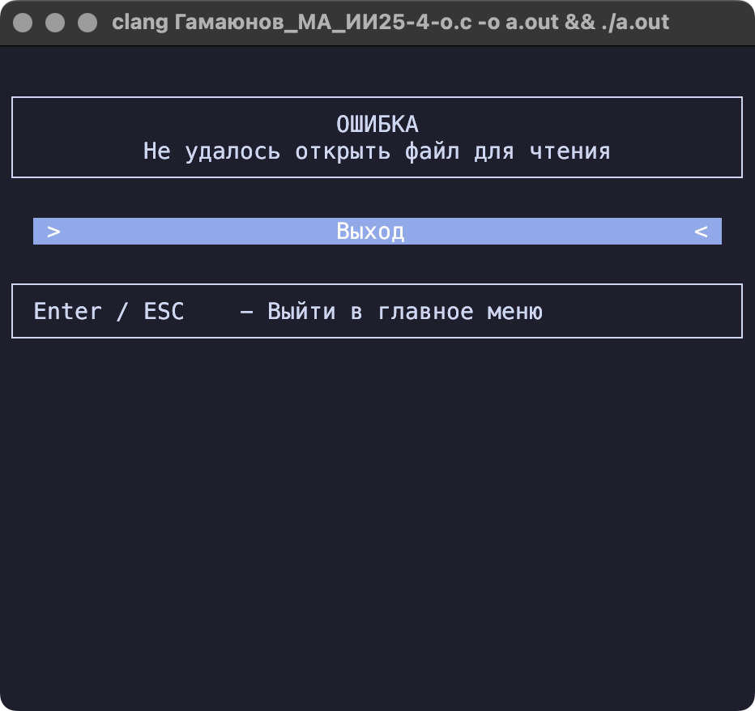
> **Инженерное решение:** Оконная подсистема модальных уведомлений `ErrorBox`. Информативные окна предупреждений при попытке загрузить несуществующий файл, при нарушении формата входных данных или вызове операций над пустой базой данных с корректным возвратом в меню.

---

## 🏗️ Архитектура системы

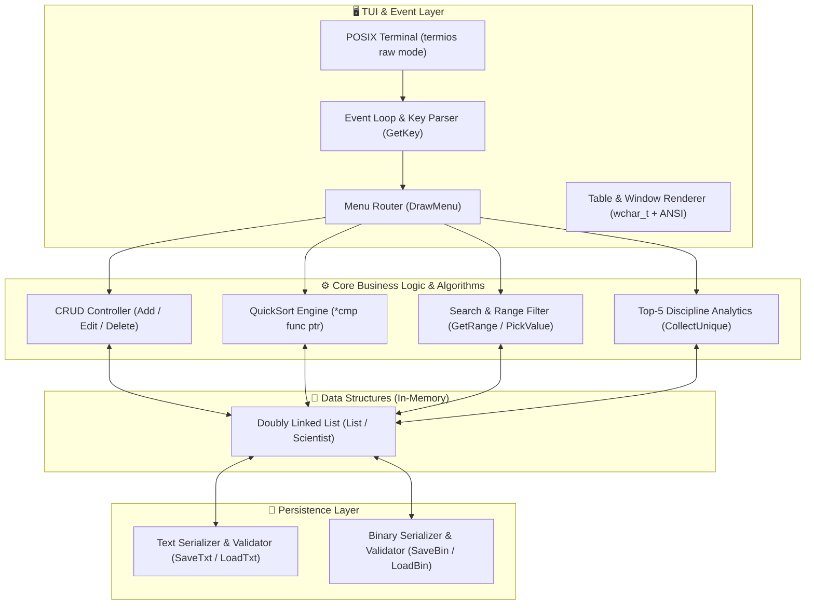
```mermaid
flowchart TD
    subgraph UI_Layer["🖥️ TUI & Event Layer"]
        Terminal["POSIX Terminal (termios raw mode)"] --> InputParser["Event Loop & Key Parser (GetKey)"]
        InputParser --> MenuRouter["Menu Router (DrawMenu)"]
        TableRenderer["Table & Window Renderer (wchar_t + ANSI)"]
    end

    subgraph Business_Layer["⚙️ Core Business Logic & Algorithms"]
        MenuRouter --> CRUD["CRUD Controller (Add / Edit / Delete)"]
        MenuRouter --> Sorter["QuickSort Engine (*cmp func ptr)"]
        MenuRouter --> SearchEngine["Search & Range Filter (GetRange / PickValue)"]
        MenuRouter --> Analytics["Top-5 Discipline Analytics (CollectUnique)"]
    end

    subgraph Data_Layer["💾 Data Structures (In-Memory)"]
        CRUD <--> DList["Doubly Linked List (List / Scientist)"]
        Sorter <--> DList
        SearchEngine <--> DList
        Analytics <--> DList
    end

    subgraph Storage_Layer["📁 Persistence Layer"]
        DList <--> TxtIO["Text Serializer & Validator (SaveTxt / LoadTxt)"]
        DList <--> BinIO["Binary Serializer & Validator (SaveBin / LoadBin)"]
    end
```

### Модели данных

Сущность исследователя (`Scientist`) и узел двусвязного списка (`List`):

```c
typedef struct {
    int id;                 // Уникальный автоинкрементный идентификатор
    wchar_t fam[32];        // Фамилия
    wchar_t im[32];         // Имя
    wchar_t ot[32];         // Отчество
    wchar_t obl[32];        // Научная область (дисциплина)
    wchar_t step[32];       // Учёная степень (к.т.н., д.ф.-м.н., и т.д.)
    int stat;               // Количество опубликованных статей
    int hirsh;              // Индекс Хирша (h-index)
    int cit;                // Суммарное количество цитирований
} Scientist;

typedef struct List {
    Scientist data;         // Полезная нагрузка
    struct List *prev;      // Указатель на предыдущий узел
    struct List *next;      // Указатель на следующий узел
} List;
```

---

## 📊 Алгоритмическая спецификация

| Операция | Алгоритм / Реализация | Сложность (Time) | Память (Space) | Особенности |
| :--- | :--- | :---: | :---: | :--- |
| **Сортировка базы** | QuickSort на двусвязном списке | $O(N \log N)$ ср. / $O(N^2)$ худш. | $O(\log N)$ стек | In-place сортировка через обмен полезной нагрузки (`SwapSci`) с предикатами |
| **Селектор уникальных значений** | Runtime Set Deduplication (`CollectUnique`) | $O(N \cdot U)$ | $O(U)$ буфер | Извлечение недублирующихся областей/степеней и отрисовка TUI-меню |
| **Поиск по диапазону** | Linear Scan c компаратором границ | $O(N)$ | $O(K)$ результат | Числовые интервалы $[A; B]$ для статей, Хирша и цитирований |
| **Текстовый поиск** | Substring Match / Case-folding | $O(N \cdot M)$ | $O(K)$ результат | Нечувствителен к регистру для русской и английской латиницы (`ToLow`) |
| **Аналитика ТОП-5** | Runtime Set Aggregation + Partial Sort | $O(U \cdot N)$ | $O(U)$ буфер | $U$ — число уникальных областей; выборка лидеров внутри кластера |
| **Пагинация таблицы** | Двусвязный обход блоков по 10 записей | $O(P \cdot B)$ | $O(1)$ | Моментальное переключение страниц стрелками `←` / `→` |
| **Очистка памяти** | Итеративный обход `FreeList` | $O(N)$ | $O(1)$ | Гарантированное отсутствие утечек памяти (`Valgrind` / `ASan` clean) |

---

## 🛠️ Сборка и запуск

### Требования к окружению
- **ОС:** macOS, Linux (любой POSIX-совместимый дистрибутив).
- **Компилятор:** `clang` (Apple Clang / LLVM) или `gcc` с поддержкой стандарта C99.
- **Терминал:** С поддержкой UTF-8 и ANSI escape-кодов (Terminal.app, iTerm2, Alacritty, Kitty, GNOME Terminal).

### Компиляция

```bash
# Клонирование репозитория
git clone https://github.com/git-sudo-ai/<repo-name>.git
cd <repo-name>

# Сборка с оптимизацией и строгими флагами проверок
clang -std=c99 -Wall -Wextra -O2 "Гамаюнов_МА_ИИ25-4-о.c" -o scientists_db

# Или с помощью GCC:
# gcc -std=c99 -Wall -Wextra -O2 "Гамаюнов_МА_ИИ25-4-о.c" -o scientists_db
```

### Запуск

```bash
./scientists_db
```

> **Совет:** Рекомендуемый минимальный размер окна терминала — **125 столбцов на 35 строк** для корректного отображения широких псевдографических рамок.

---

## 🎮 Управление в TUI

| Клавиша | Контекст | Действие |
| :---: | :---: | :--- |
| `↑` / `↓` | Главное меню / Диалоги / `PickValue` | Перемещение курсора выбора |
| `Enter` | Везде | Подтверждение выбора / вход в подменю |
| `←` / `→` | Таблица / Аналитика ТОП-5 | Перелистывание страниц пагинации |
| `ESC` | Любое подменю | Возврат на предыдущий экран / выход |

---

## 🎓 Академический контекст

- **Учебное заведение:** Севастопольский государственный университет (СевГУ / СевНТУ)
- **Институт:** Институт информационных технологий и управления в технических системах
- **Кафедра:** «Информационные технологии и системы» (ИТиС)
- **Направление подготовки:** 09.03.02 «Информационные системы и технологии»
- **Дисциплина:** Алгоритмы и программирование (2 семестр)
- **Тема работы:** Разработка программного обеспечения для обработки табличной информации со сведениями об учёных
- **Автор:** Гамаюнов М. А. ([@git-sudo-ai](https://github.com/git-sudo-ai))
- **Среда разработки:** Neovim v0.11.5, Clang, macOS (Darwin aarch64)
